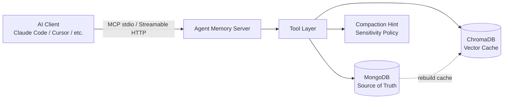
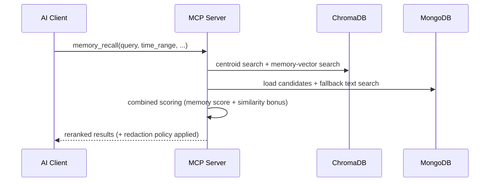

<p align="center">
  <a href="./README.md"></a>
  <a href="./README.ko.md"></a>
</p>
<p align="center"><sub>Switch language / 언어 전환</sub></p>

# Agent Memory System | 에이전트 메모리 시스템

지속형 AI 비서를 위한 장기 기억 아키텍처입니다.

상태: Release Candidate (RC1)  
런타임: Python 3.11+  
저장소: MongoDB (Source of Truth) + ChromaDB (Vector Cache)

## 1. Introduction

Agent Memory System은 지속형 AI 비서를 위해 설계된 장기 기억 아키텍처입니다.

AI 모델은 보통 세션이 바뀌면 사실상 상태를 잃고 다시 시작합니다. 하지만 개인 비서는 며칠, 몇 주, 몇 달에 걸친 연속성이 필요합니다. 이 프로젝트는 그 연속성을 위한 전용 기억 계층을 제공합니다. 원시 대화 로그를 장기 기억의 기본 단위로 삼는 대신, 정제된 기억을 기본 단위로 두고 구조화된 회상, digest 계층, 토픽 계층을 통해 다시 활용할 수 있게 만듭니다.

시스템은 Model Context Protocol(MCP)로 노출되므로, 기본 기억 모델을 바꾸지 않고도 에이전트 런타임, CLI 도구, 개발 환경에 연결할 수 있습니다.

## 2. Design Philosophy

이 프로젝트는 모든 대화 턴을 영구 보관하는 방식으로 설계되지 않았습니다.

- memory는 로그가 아닙니다.
- memory는 선택적입니다.
- memory는 압축된 의미입니다.
- memory는 시간에 따라 다시 해석됩니다.
- `memory != conversation log`
- `memory = compacted meaning`

핵심 흐름은 다음과 같습니다.

```text
conversation
  -> candidate extraction / compaction
  -> memory
```

이 프로젝트는 모든 상호작용을 저장하려 하지 않습니다.

대신, 의미 있는 경험을 시간축 위에서 다시 사용할 수 있도록 정제한 표현으로 memory를 모델링합니다.

실제로는 다음을 뜻합니다.

- 원시 대화는 장기 기억의 정본 단위로 취급하지 않습니다.
- 기억의 품질은 클라이언트가 무엇을 저장하고 어떻게 요약하느냐에 달려 있습니다.
- 시스템은 시간 필터, 최신순 브라우징, digest 갱신 흐름을 지원합니다.
- 오래된 기억도 버려지지 않고 배경 맥락으로 남아 있습니다.
- digest 계층은 텍스트 누적이 아니라 해석된 의미를 이어가기 위해 존재합니다.

이 프로젝트는 vector database wrapper가 아닙니다.

지속형 AI 비서를 위한 memory architecture입니다.

## 3. Memory Model

### Memory Layers

이 시스템은 원시 대화 기록이 아니라 계층형 구조로 기억을 다룹니다.

```text
raw conversation (not the primary long-term unit)
  -> memory (structured unit)
  -> digest layers
  -> topic hierarchy
```

- `memory`는 사실, 선호, 계획, 사건처럼 의미 있는 내용을 담는 기본 저장 단위입니다.
- `digests`는 여러 memory를 일간, 주간, 월간, 연간 요약으로 압축합니다.
- `topic hierarchy`는 `topic_path(T1→T4)`를 통해 기억의 의미 계보를 정리합니다.

### Temporal Weighting

기억 회상은 시간 정보를 함께 고려합니다.

- `time_range`는 생성 시각 기준으로 후보 범위를 좁힙니다.
- query 없이 브라우징할 때는 최신 기억이 먼저 반환됩니다.
- 오래된 기억도 의미 검색, digest, topic context를 통해 계속 참조될 수 있습니다.
- 현재 ranked recall은 별도의 최신성 보너스가 아니라 memory 점수와 semantic similarity를 함께 사용합니다.

### Compaction Model (Client-Driven)

Compaction은 의도적으로 클라이언트 주도 방식입니다.

- 의미 해석은 실제 대화를 이해한 클라이언트 또는 비서가 담당합니다.
- 서버는 저장, 후보 선택, 수명주기 조정에 책임을 둡니다.
- 서버 내부에서 숨겨진 LLM 요약을 수행하지 않습니다.

운영 원칙은 단순합니다.

`memory quality is determined at the save stage`

Compaction 수명주기:

```text
experience / conversation
  -> candidate extraction / compaction
  -> memory
  -> digest
  -> hierarchy
```

실행 흐름:

1. `memory_save`가 compaction hint를 반환합니다.
2. 클라이언트가 `memory_compact(level=...)`를 호출합니다.
3. 서버가 원본 memory 또는 digest 후보를 반환합니다.
4. 클라이언트가 digest 텍스트를 작성합니다.
5. 클라이언트가 `memory_save(category="digest", ...)`로 저장합니다.

임계치:

- `L1`: yesterday uncompacted >= 3
- `L2`: last week L1 digests >= 5
- `L3`: last month L2 digests >= 3
- `L4`: last year L3 digests >= 6

## 4. Architecture

아키텍처는 MongoDB를 source of truth로 유지하고, ChromaDB를 재구축 가능한 벡터 캐시로 취급합니다.



### Recall Path (Dual-Layer)



핵심 아키텍처 결정:

- MongoDB는 지속 저장을 담당하는 단일 source of truth입니다.
- ChromaDB는 의미 검색을 위한 파생 캐시이며 MongoDB 기준으로 재구축할 수 있습니다.
- MCP 서버는 데이터 계층입니다. 내부에서 LLM을 호출하지 않습니다.
- 민감도 정책은 recall과 summarize 경계에서 적용됩니다.

## 5. MCP Interface

시스템 기능은 MCP를 통해 노출되므로, 여러 클라이언트가 같은 기억 모델을 공유할 수 있습니다.

MCP는 이 프로젝트의 정체성이라기보다 구현 인터페이스입니다.

### Tools

| Tool | 설명 |
|:--|:--|
| `memory_save` | 카테고리/중요도/민감도와 선택형 source agent/client 메타데이터 기반 기억 저장 |
| `memory_recall` | 의미/날짜 기반 회상, similarity 재랭킹, debug/sensitive 옵션 지원, debug 출력에 source 메타데이터 포함 |
| `memory_summarize` | 카테고리/토픽별 기억 요약 |
| `session_digest` | 대화 내용을 기억 후보로 추출 |
| `memory_approve` | pending 기억 조회/승인/기각 |
| `memory_compact` | digest 생성을 위한 compaction 후보 반환 |
| `memory_update` | 기존 기억 필드 업데이트 |
| `memory_delete` | 기억 삭제 및 topic 카운트 동기화 |
| `topic_lookup` | 계층 토픽 검색/상세 조회 |
| `memory_policy` | 민감도 정책 조회/수정 |

### Resources

| Resource | 설명 |
|:--|:--|
| `user://profile` | 사용자 프로필 요약 |
| `memory://recent` | 최근 7일 기억 타임라인 |
| `memory://stats` | 기억 통계 및 카테고리 분포 |
| `memory://compaction-status` | 레벨별 compaction 준비 상태 |

### Prompts

| Prompt | 설명 |
|:--|:--|
| `memory_tool_guide` | 기억 관련 질문에는 먼저 recall하고, 저장은 distilled memory로 남기며, 긴 대화는 `session_digest`로 정리하고, `memory_policy`를 따르도록 안내하는 선택형 prompt |

## 6. Usage

### Transport Modes

이 프로젝트에는 MCP transport가 2가지 있습니다.

| Transport | 적합한 경우 | 실행 방식 | 설명 |
|:--|:--|:--|:--|
| `stdio` | 로컬 IDE/CLI 연동, subprocess MCP 서버를 기대하는 클라이언트 | `python -m src.server` 또는 `scripts/run_mcp_docker.sh` | 보통 클라이언트/세션 1개당 서버 프로세스 1개가 필요합니다. Docker에서는 세션마다 컨테이너가 하나씩 생기기 쉽습니다. |
| `streamable-http` | shared Docker/server 배포, 여러 클라이언트가 서버 1개를 재사용하는 경우 | `docker compose up -d mcp-http` | 장기 실행 서버 1개가 여러 클라이언트 연결을 HTTP로 받을 수 있습니다. |

즉 transport는 2개지만, 아래 예시에서는 실제 사용 방식이 3가지로 보일 수 있습니다.

- 로컬 venv 기반 `stdio`
- Docker launcher 기반 `stdio`
- shared `mcp-http` 기반 `streamable-http`

권장 기본값:

- Docker와 multi-client 용도에는 `streamable-http`를 우선 권장
- MCP 클라이언트가 subprocess 서버를 꼭 요구할 때만 `stdio` 사용

### Quick Start (Docker, Recommended)

```bash
cp .env.example .env
docker compose build app
docker compose up -d mongodb chroma mcp-http
docker compose run --rm app python scripts/init_db.py
docker compose run --rm app python scripts/seed_rules.py
docker compose run --rm app python scripts/init_profile.py
```

`.env.example`는 host-side 실행 기준(`localhost:27018` / `localhost:8001`)으로 맞춰져 있습니다.
반면 app 컨테이너는 `docker-compose.yml`의 `DOCKER_*` override를 사용하므로, host 값이 컨테이너 내부 네트워크 설정에 섞이지 않습니다.

기본 shared endpoint:

```text
http://localhost:8002/mcp
```

종료:

```bash
docker compose down
```

### Shared Streamable HTTP (Docker, Recommended)

여러 MCP 클라이언트가 컨테이너 1개를 공유해야 한다면, 세션마다 stdio 서버를 띄우지 말고 전용 HTTP 서비스를 올리면 됩니다.

```bash
docker compose up -d mongodb chroma mcp-http
```

기본 엔드포인트:

```text
http://localhost:8002/mcp
```

이 방식이면 `docker compose run ... python -m src.server` 때문에 클라이언트 세션마다 컨테이너가 하나씩 늘어나는 문제를 피할 수 있습니다. `scripts/run_mcp_docker.sh`는 stdio가 꼭 필요한 클라이언트에서만 유지하면 됩니다.

라이프사이클 메모:

- `mcp-http`는 장기 실행 서비스라서 `docker compose stop mcp-http` 또는 `docker compose down`을 하기 전까지 계속 살아 있습니다
- `mongodb`, `chroma`도 backend 서비스라서 명시적으로 멈추기 전까지 계속 살아 있습니다

### Memory-Aware Client Guidance

서버는 이제 선택형 MCP prompt 하나를 함께 노출합니다.

- `memory_tool_guide`

클라이언트가 prompt argument를 지원하면 현재 사용자 요청을 `user_request`로 함께 넘기면 됩니다.

권장 클라이언트 system prompt:

```text
사용자가 내가 무엇을 기억하는지, 전에 무슨 말을 했는지, 과거의 선호/계획/사실/이벤트를 묻는다면 답변 전에 `memory_recall`을 먼저 호출한다.
`memory_save`는 사용자가 명시적으로 기억해 달라고 요청했거나, 대화 중 세션을 넘어 유지할 가치가 있는 중요하고 지속적인 사실/계획/선호가 드러났을 때만 사용한다.
사용자가 기억 시스템 자체를 질문하고 있다는 이유만으로 스타일이나 선호를 자동 저장하지 않는다.
대화가 길고 기억 후보가 여러 개라면 raw conversation을 통째로 저장하지 말고 `session_digest`로 후보를 정리한다.
민감한 내용이 섞일 수 있으면 `memory_policy`를 따르고, 사용자의 요청이 명시적일 때만 민감 상세를 포함한다.
```

대부분의 클라이언트에서는 이 system prompt가 더 강한 유도 장치입니다. MCP prompt는 도움이 되지만, 많은 클라이언트가 이를 자동으로 매 요청에 적용하지는 않습니다.

실제 지침 우선순위:

- 클라이언트/플랫폼 system prompt
- 클라이언트 로컬 rules 또는 workspace instructions
- MCP prompt 및 tool description

그래서 의도한 기억 동작을 이식 가능하게 전달하려면, README와 배포 시 넣는 클라이언트 설정에 운영 규칙을 명시하는 편이 가장 안전합니다. 이 저장소는 모든 MCP 클라이언트용 로컬 rules 파일을 함께 배포하지는 않습니다.

클라이언트에 자체 memory 또는 로컬 note 시스템이 있다면, 배포하는 클라이언트 설정에서 이 MCP 서버와의 우선순위를 함께 문서화해야 합니다. 그렇지 않으면 `memory_save`보다 로컬 메모리가 먼저 트리거되는 split memory 동작이 생길 수 있습니다.

클라이언트/에이전트 사용 시 주의점:

- 일부 문제는 이 MCP 서버가 아니라 클라이언트 에이전트에서 발생합니다. recall query에 현재 저장소 키워드가 섞이면, 대체로 서버 문제가 아니라 에이전트의 query 구성 문제입니다.
- 자체 memory 또는 파일 기반 note 시스템이 있는 클라이언트는 MCP 동작을 덮어쓸 수 있습니다. Claude Code가 대표적인 예로, 배포한 클라이언트 설정에서 우선순위를 정해주지 않으면 내장 파일 메모리가 `memory_save`보다 먼저 트리거될 수 있습니다.
- MCP prompt와 tool description은 약한 유도 장치입니다. 더 강한 클라이언트 system prompt나 내장 동작을 안정적으로 덮어쓰지는 못합니다.
- 크로스 에이전트 재사용에도 주의가 필요합니다. 출처가 중요하다면 `source_agent`, `source_client`를 함께 저장하세요. 이런 메타데이터가 없으면 한 도구에서 저장한 기억이 다른 도구에서는 오해를 부를 수 있습니다.

일부 가이드를 README에 두고 런타임 prompt에는 넣지 않는 이유:

- 현재 `memory_recall`의 query 구성 가이드는 기본 런타임 prompt/tool surface가 아니라 문서에 둡니다. 이 내용은 검색 품질에 직접 영향을 주기 때문에, 모든 상황에 강제하는 기본 규칙으로 넣기에는 과도할 수 있습니다.
- `memory_tool_guide`도 기본값에서는 너무 많은 정책을 실지 않습니다. 이 prompt의 역할은 가벼운 도구 안내이지, 전체 행동 정책 집행이 아닙니다.
- 나중에 더 강한 제어가 필요하면, 모든 정책을 기본 prompt 하나에 밀어 넣는 것보다 운영 모드를 분리하는 편이 더 깔끔할 가능성이 큽니다.

### Stdio Run (Compatibility)

이 경로는 MCP 클라이언트가 `stdio`를 꼭 요구할 때만 사용하면 됩니다.

#### Local Run (Optional)

```bash
cp .env.example .env
docker compose up -d mongodb chroma
python3 -m venv .venv
source .venv/bin/activate
pip install -e .[dev]
python scripts/init_db.py
python scripts/seed_rules.py
python scripts/init_profile.py
# stdio 모드
python -m src.server
```

로컬 초기 구동 메모:

- 처음 로컬 환경을 띄울 때는 Python 의존성을 머신에 설치하므로 준비 시간이 꽤 걸릴 수 있습니다.
- 첫 임베딩 기반 recall 또는 preload 시점에는 임베딩 모델을 로컬에서 다운로드하고 메모리에 로드해야 해서 추가 시간이 걸릴 수 있습니다.
- 이후에는 가상환경과 임베딩 캐시가 준비된 상태라 보통 훨씬 빨라집니다.

공유 프로세스가 필요하면 로컬에서도 HTTP 모드로 실행할 수 있습니다.

```bash
MCP_TRANSPORT=streamable-http python -m src.server
```

Docker stdio 라이프사이클 메모:

- `docker compose run --rm ... app python -m src.server`는 일시적인 `app` 컨테이너를 만듭니다
- MCP 클라이언트/에이전트 연결이 끊기면 stdio 프로세스가 종료되고, `--rm` 때문에 `app` 컨테이너도 함께 삭제됩니다
- `mongodb`, `chroma`는 자동으로 내려가지 않습니다

### MCP Client Setup (Claude Code)

여기서 헷갈리기 쉬운 부분을 먼저 정리하면:

- 권장 경로는 `streamable-http`
- 호환용 fallback이 `stdio`
- Option A와 Option B는 둘 다 `stdio`

먼저 백엔드를 실행합니다.

```bash
docker compose up -d mongodb chroma mcp-http
```

`PRELOAD_EMBEDDING_MODEL=false`를 Docker MCP 등록의 안전한 기본값으로 둡니다.
서버 시작 전에 임베딩 모델 다운로드가 걸리면 stdio가 열리기 전에 일부 클라이언트 등록이 timeout 날 수 있습니다.
처음에는 `false`로 두고 모델 다운로드/캐시가 끝난 뒤에만 `true`로 바꿔 startup preload를 쓰는 편이 안전합니다.

Claude Code 사용 시 주의:

- Claude Code는 "기억해줘" 같은 요청에서 MCP memory tool보다 내장 파일 메모리를 우선 사용할 수 있습니다.
- 이 서버를 주 기억 계층으로 쓰고 싶다면, 그 규칙은 MCP prompt 텍스트만이 아니라 실제 배포하는 클라이언트 설정에 넣어야 합니다.
- 팀 문서나 운영 가이드에는 우선순위를 분명히 적는 편이 안전합니다: MCP memory 우선 사용, 로컬 파일 메모리는 비활성 또는 보조 수단으로 취급.

#### Recommended. Shared Streamable HTTP server

HTTP를 지원하는 MCP 클라이언트라면, shared 서비스를 한 번 띄워두고 아래 엔드포인트에 연결하면 됩니다.

```text
http://localhost:8002/mcp
```

```bash
docker compose up -d mongodb chroma mcp-http
```

Docker 안에서 여러 클라이언트가 하나의 서버 컨테이너를 재사용해야 할 때 이 모드가 가장 적합합니다.

#### Compatibility Option A. Local venv stdio server

`<PROJECT_DIR>`를 로컬 저장소 경로로 바꿔 사용하세요.

```json
{
  "mcpServers": {
    "agent-memory": {
      "command": "/bin/bash",
      "args": [
        "-lc",
        "cd \"<PROJECT_DIR>\" && source .venv/bin/activate && python -m src.server"
      ]
    }
  }
}
```

#### Compatibility Option B. Docker stdio server

`<PROJECT_DIR>`를 로컬 저장소 경로로 바꿔 사용하세요.

```json
{
  "mcpServers": {
    "agent-memory": {
      "command": "<PROJECT_DIR>/scripts/run_mcp_docker.sh",
      "args": []
    }
  }
}
```

이 런처는 저장소 루트를 스스로 찾은 뒤 `docker compose ... app python -m src.server`를 실행합니다.
기본값은 `.env`의 `PRELOAD_EMBEDDING_MODEL=false`로 두고, 정말 필요할 때만 override해서 쓸 수 있습니다.

```bash
PRELOAD_EMBEDDING_MODEL=true ./scripts/run_mcp_docker.sh
```

### Usage Examples

기억 저장:

```json
{
  "name": "memory_save",
  "arguments": {
    "content": "사용자는 무설탕 탄산수를 선호한다.",
    "category": "preference",
    "importance": 8,
    "sensitivity": "normal",
    "source_agent": "gpt-5.4",
    "source_client": "codex-cli"
  }
}
```

의미 + 날짜 회상:

```json
{
  "name": "memory_recall",
  "arguments": {
    "query": "탄산수 선호",
    "time_range": "30d",
    "top_k": 5
  }
}
```

쿼리 없이 날짜 브라우징:

```json
{
  "name": "memory_recall",
  "arguments": {
    "time_range": "7d",
    "include_debug": true
  }
}
```

민감정보 선택 확장:

```json
{
  "name": "memory_recall",
  "arguments": {
    "query": "개인 건강 정보",
    "include_sensitive": true
  }
}
```

### Sensitivity Policy Model

- 저장/수정 시 에이전트가 `sensitivity(normal|medium|high)`를 직접 지정합니다.
- 서버는 키워드 기반 자동 상향 판단을 하지 않습니다.
- `hide_sensitive_on_recall=true`이면 `high` 항목은 기본적으로 가려집니다.
- `include_sensitive=true`일 때만 상세 노출이 확장됩니다.

### Configuration

host-side `.env`는 compose가 열어둔 포트(`localhost:27018` / `localhost:8001`)를 바라보도록 둘 수 있고, `app` 서비스는 컨테이너 내부 연결값만 `DOCKER_*`로 별도 주입합니다.
`EMBEDDING_MODEL_NAME`를 공개 Hugging Face / `sentence-transformers` 모델 ID로 바꾸면 첫 사용 시 다운로드되고, Docker app은 이를 `DOCKER_EMBEDDING_CACHE_DIR` 아래에 캐시합니다.

| Env | 예시값 | 설명 |
|:--|:--|:--|
| `MONGODB_URI` | `mongodb://localhost:27018` | host-side Mongo 연결 URI |
| `DB_NAME` | `agent_memory` | 데이터베이스 이름 |
| `CHROMA_ENABLED` | `true` | Chroma 벡터 경로 활성화 |
| `CHROMA_HOST` | `localhost` | host-side Chroma 호스트 |
| `CHROMA_PORT` | `8001` | host-side Chroma 포트 |
| `CHROMA_SSL` | `false` | Chroma TLS 사용 여부 |
| `CHROMA_COLLECTION_NAME` | `memory_bge_m3_v1` | 활성 컬렉션 이름 |
| `EMBEDDING_MODEL_NAME` | `dragonkue/BGE-m3-ko` | 임베딩 모델 이름 |
| `EMBEDDING_DEVICE` | `cpu` | 임베딩 실행 디바이스 |
| `EMBEDDING_CACHE_DIR` | empty | 로컬 캐시 경로 |
| `EMBEDDING_MAX_CHARS` | `1200` | 임베딩 전 최대 문자 수 |
| `PRELOAD_EMBEDDING_MODEL` | `false` | MCP 서버가 요청을 받기 전에 임베딩 모델을 preload할지 여부. 첫 Docker 등록은 `false`로 두고, 모델 캐시가 준비된 뒤에만 `true` 사용 권장 |
| `MCP_TRANSPORT` | `stdio` | MCP transport 모드: `stdio` 또는 `streamable-http` |
| `MCP_HTTP_HOST` | `127.0.0.1` | Streamable HTTP 모드 바인드 호스트 |
| `MCP_HTTP_PORT` | `8002` | Streamable HTTP 모드 포트 |
| `MCP_HTTP_PATH` | `/mcp` | Streamable HTTP 모드 마운트 경로 |
| `DOCKER_MONGODB_URI` | `mongodb://mongodb:27017` | app 컨테이너에서만 쓰는 Mongo URI |
| `DOCKER_CHROMA_HOST` | `chroma` | app 컨테이너에서만 쓰는 Chroma 호스트 |
| `DOCKER_CHROMA_PORT` | `8000` | app 컨테이너에서만 쓰는 Chroma 포트 |
| `DOCKER_EMBEDDING_CACHE_DIR` | `/app/.cache/models` | app 컨테이너에서만 쓰는 모델 캐시 경로 |
| `CENTROID_STALE_DAYS` | `14` | stale centroid 판단 일수 |
| `SIMILARITY_WEIGHT` | `15.0` | recall 점수 계산 시 의미 유사도 보너스 가중치 |

## 7. Project Scope

### Release Candidate Scope

- 안정적인 MCP tool/resource 계약
- MongoDB source of truth + 재구축 가능한 Chroma cache
- 의미 기반 retrieval + 시간 필터 + 최신순 브라우징을 포함한 dual-layer recall
- 클라이언트 주도 compaction 워크플로우
- 기본 보호형 민감 기억 제어와 명시적 확장
- `topic_path(T1→T4)` 기반 topic hierarchy

### Project Layout

```text
src/
  server.py                MCP 서버 엔트리포인트
  tools/                   MCP 도구
  resources/               MCP 리소스
  db/                      Mongo 연결, CRUD, 인덱스
  engine/                  memory, recall, compaction, scoring 엔진
scripts/
  init_db.py               DB 초기화
  seed_rules.py            초기 rule seed
  init_profile.py          기본 profile 초기화
  rebuild_chroma.py        Mongo SoT 기준 벡터 캐시 재구축
  reindex_chroma.py        Chroma 문서 재동기화/백필
  run_mcp_docker.sh        Docker stdio 런처
docker-compose.yml         로컬 스택 + shared `mcp-http` 서비스
```

### Third-Party License Notice

| 컴포넌트 | 라이선스 | 참고 링크 |
|:--|:--|:--|
| 임베딩 모델 `dragonkue/BGE-m3-ko` | Apache License 2.0 | https://huggingface.co/dragonkue/BGE-m3-ko |
| ChromaDB (`chroma-core/chroma`) | Apache License 2.0 | https://github.com/chroma-core/chroma |
| MongoDB Community Server (`mongo:7`) | Server Side Public License (SSPL) v1 | https://github.com/mongodb/mongo |

각 컴포넌트의 사용 및 재배포는 해당 라이선스 조건을 따라야 합니다.
