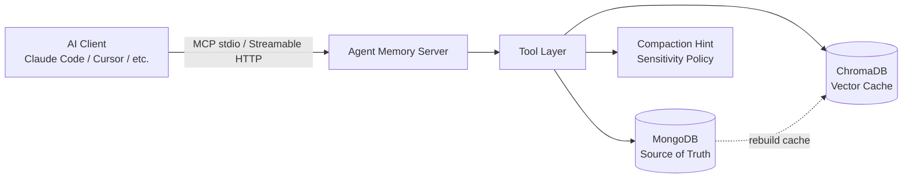
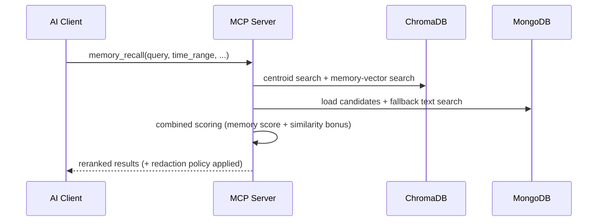

<p align="center">
  <a href="./README.md"></a>
  <a href="./README.ko.md"></a>
</p>
<p align="center"><sub>Switch language / 언어 전환</sub></p>

# Agent Memory System

Long-term memory architecture for persistent AI assistants.

Status: Release Candidate (RC1)  
Runtime: Python 3.11+  
Storage: MongoDB (Source of Truth) + ChromaDB (Vector Cache)

## 1. Introduction

Agent Memory System is a long-term memory architecture designed for persistent AI assistants.

AI models are typically stateless across sessions. A personal assistant, however, needs continuity across days, weeks, and months. This project provides that continuity as a dedicated memory layer: it treats distilled memories, not raw chat logs, as the primary long-term unit and keeps them available through structured recall, digest layers, and topic hierarchy.

The system is exposed through the Model Context Protocol (MCP) so it can integrate with agent runtimes, CLI tools, and development environments without changing the underlying memory model.

## 2. Design Philosophy

This project is not built around storing every conversation turn forever.

- Memory is not a log.
- Memory is selective.
- Memory is compacted meaning.
- Memory is reinterpreted over time.
- `memory != conversation log`
- `memory = compacted meaning`

The core flow is:

```text
conversation
  -> candidate extraction / compaction
  -> memory
```

This project does not attempt to store every interaction.

Instead, it models memory as a distilled, time-aware representation of meaningful experiences.

In practice, that means:

- Raw conversation is not treated as the canonical long-term unit.
- Memory quality depends on what the client decides to save and how it summarizes it.
- The system supports time-range filtering, recent-first browsing, and digest refresh over time.
- Older memories remain available as context instead of being discarded.
- Digest layers exist so the assistant can carry forward interpreted meaning, not just accumulated text.

This is not a vector database wrapper.

It is a memory architecture for persistent AI assistants.

## 3. Memory Model

### Memory Layers

The system organizes memory as a layered structure rather than raw transcript storage.

```text
raw conversation (not the primary long-term unit)
  -> memory (structured unit)
  -> digest layers
  -> topic hierarchy
```

- `memory` is the primary stored unit for meaningful facts, preferences, plans, and events.
- `digests` compact multiple memories into daily, weekly, monthly, and yearly summaries.
- `topic hierarchy` organizes memories by semantic lineage through `topic_path(T1→T4)`.

### Temporal Weighting

Memory retrieval is time-aware.

- `time_range` narrows candidate selection by creation time.
- Query-less browsing returns recent memories first.
- Older memories remain available through semantic retrieval, digests, and topic context.
- Ranked recall is currently driven by memory score plus semantic similarity, not by a separate recency bonus.

### Compaction Model (Client-Driven)

Compaction is intentionally client-driven.

- Meaning interpretation belongs to the client or assistant that actually understands the conversation.
- The server is responsible for storage, candidate selection, and lifecycle coordination.
- The server does not perform hidden LLM summarization internally.

The operating principle is simple:

`memory quality is determined at the save stage`

Compaction lifecycle:

```text
experience / conversation
  -> candidate extraction / compaction
  -> memory
  -> digest
  -> hierarchy
```

Operational flow:

1. `memory_save` returns a compaction hint.
2. The client calls `memory_compact(level=...)`.
3. The server returns raw source memories or digests.
4. The client writes the digest text.
5. The client saves the digest via `memory_save(category="digest", ...)`.

Thresholds:

- `L1`: yesterday uncompacted >= 3
- `L2`: last week L1 digests >= 5
- `L3`: last month L2 digests >= 3
- `L4`: last year L3 digests >= 6

## 4. Architecture

The architecture keeps MongoDB as the source of truth and treats ChromaDB as a rebuildable vector cache.



### Recall Path (Dual-Layer)



Key architectural decisions:

- MongoDB is the single source of truth for durable memory state.
- ChromaDB is derived cache for semantic retrieval and can be rebuilt from MongoDB.
- The MCP server is a data layer. It does not call an internal LLM.
- Sensitivity policy is enforced at recall and summary boundaries.

## 5. MCP Interface

The system exposes its functionality through MCP so that different clients can share the same memory model.

MCP is the interface layer, not the main identity of the project.

### Tools

| Tool | Description |
|:--|:--|
| `memory_save` | Save memory with category/importance/sensitivity and optional source agent/client metadata |
| `memory_recall` | Semantic/date recall with similarity reranking, debug/sensitive options, and source metadata in debug output |
| `memory_summarize` | Summarize memories by category/topic |
| `session_digest` | Extract memory candidates from conversation |
| `memory_approve` | List/approve/dismiss pending memories |
| `memory_compact` | Return compaction candidates for digesting |
| `memory_update` | Update existing memory fields |
| `memory_delete` | Delete memory and sync topic counters |
| `topic_lookup` | Search and inspect topic hierarchy |
| `memory_policy` | Get/set sensitivity policy |

### Resources

| Resource | Description |
|:--|:--|
| `user://profile` | User profile summary |
| `memory://recent` | Recent memory timeline (7 days) |
| `memory://stats` | Memory statistics and category distribution |
| `memory://compaction-status` | Compaction readiness by level |

### Prompts

| Prompt | Description |
|:--|:--|
| `memory_tool_guide` | Optional guidance prompt for assistants: recall before answering memory-related questions, save distilled memories, use `session_digest` for longer conversations, and respect `memory_policy` |

## 6. Usage

### Transport Modes

There are two MCP transport modes in this project:

| Transport | Best for | Launch pattern | Notes |
|:--|:--|:--|:--|
| `stdio` | Local IDE/CLI integrations, clients that expect subprocess MCP servers | `python -m src.server` or `scripts/run_mcp_docker.sh` | One client/session usually means one server process. In Docker, that often means one container per session. |
| `streamable-http` | Shared Docker/server deployment, multiple clients reusing one server | `docker compose up -d mcp-http` | One long-running server can accept multiple client connections over HTTP. |

So the project now has two transports, but three practical setup options in the examples below:

- `stdio` via local venv
- `stdio` via Docker launcher
- `streamable-http` via shared `mcp-http` service

Recommended default:

- For Docker and multi-client use, prefer `streamable-http`
- Use `stdio` only when your MCP client specifically expects a subprocess server

### Quick Start (Docker, Recommended)

```bash
cp .env.example .env
docker compose build app
docker compose up -d mongodb chroma mcp-http
docker compose run --rm app python scripts/init_db.py
docker compose run --rm app python scripts/seed_rules.py
docker compose run --rm app python scripts/init_profile.py
```

`.env.example` is tuned for host-side runs (`localhost:27018` / `localhost:8001`).
The app container uses `DOCKER_*` overrides from `docker-compose.yml`, so host values do not leak into in-container networking.

Default shared endpoint:

```text
http://localhost:8002/mcp
```

Stop services:

```bash
docker compose down
```

### Shared Streamable HTTP (Docker, Recommended)

If you want one long-running container that multiple MCP clients can share, start the dedicated HTTP service instead of launching the stdio server per session:

```bash
docker compose up -d mongodb chroma mcp-http
```

Default endpoint:

```text
http://localhost:8002/mcp
```

This avoids the `docker compose run ... python -m src.server` pattern creating one container per client session. Keep `scripts/run_mcp_docker.sh` only for clients that specifically require stdio.

Lifecycle note:

- `mcp-http` is a long-running service and stays up until you stop it with `docker compose stop mcp-http` or `docker compose down`
- `mongodb` and `chroma` are backend services and also stay up until explicitly stopped

### Memory-Aware Client Guidance

The server now exposes one optional MCP prompt:

- `memory_tool_guide`

If your client supports prompt arguments, pass the current user request as `user_request`.

Recommended client-side system prompt:

```text
When the user asks what you remember, what they said before, or asks about their past preferences, plans, facts, or events, call `memory_recall` before answering from memory.
Only save memory with `memory_save` when the user explicitly asks to remember something, or when the conversation reveals a durable and important fact, plan, or preference worth carrying across sessions.
Do not auto-save style or preference memories just because the user is asking about the memory system itself.
When a conversation is long and contains several candidate memories, use `session_digest` instead of saving raw conversation text.
Follow `memory_policy`, and only include sensitive details when the user's request is explicit.
```

For most clients, this system prompt is the stronger nudge. MCP prompts are helpful, but many clients do not apply them automatically.

Instruction hierarchy in practice:

- Client/platform system prompt
- Client-local rules or workspace instructions
- MCP prompt and tool descriptions

Because of that hierarchy, the README and deployment-time client configuration are the portable places to document the intended memory behavior. This repository does not ship client-local rule files for every MCP client.

If a client has its own built-in memory or local note system, document how it should interact with this MCP server in the client configuration you deploy. Otherwise you can end up with split memory behavior where local memory triggers before `memory_save`.

Client and agent caveats:

- Some failures come from the client agent, not from this MCP server. If recall queries are rewritten with repository-specific keywords, the problem is usually query construction on the agent side.
- Clients with built-in memory or file-based note systems can override MCP behavior. Claude Code is a concrete example: its built-in file memory may trigger before `memory_save` unless your deployed client configuration says otherwise.
- MCP prompts and tool descriptions are weak guidance. They cannot reliably override a stronger client system prompt or built-in behavior.
- Cross-agent reuse needs care. When provenance matters, save `source_agent` and `source_client`; without source metadata, a memory from one tool environment can be misleading in another.

Why some guidance stays in README instead of runtime prompts:

- We currently keep query-construction advice for `memory_recall` in documentation, not in the default runtime prompt/tool surface. That advice affects search quality and can be too prescriptive as a universal runtime rule.
- We also avoid overloading `memory_tool_guide` with too many policy details by default. Its role is lightweight tool discovery, not full behavioral enforcement.
- If stricter behavior control is needed later, separate operating modes are likely a cleaner design than pushing every policy into one default prompt.

### Stdio Run (Compatibility)

Use this only when your MCP client requires `stdio`.

#### Local Run (Optional)

```bash
cp .env.example .env
docker compose up -d mongodb chroma
python3 -m venv .venv
source .venv/bin/activate
pip install -e .[dev]
python scripts/init_db.py
python scripts/seed_rules.py
python scripts/init_profile.py
# stdio mode
python -m src.server
```

Local startup note:

- The first local setup can take a while because Python dependencies are installed on the machine.
- The first embedding-backed recall or preload can also take extra time because the model must be downloaded and loaded locally.
- Later runs are typically much faster once the virtual environment and embedding cache are ready.

Local HTTP mode is also available when you want a shared server process:

```bash
MCP_TRANSPORT=streamable-http python -m src.server
```

Docker stdio lifecycle note:

- `docker compose run --rm ... app python -m src.server` creates a transient `app` container
- when the MCP client/agent disconnects, that stdio process exits and the `app` container is removed because of `--rm`
- `mongodb` and `chroma` do not stop automatically

### MCP Client Setup (Claude Code)

The setup options below are easy to confuse at first:

- Recommended: `streamable-http`
- Compatibility fallback: `stdio`
- Option A and Option B are both `stdio`

Run backend first:

```bash
docker compose up -d mongodb chroma mcp-http
```

`PRELOAD_EMBEDDING_MODEL=false` is the safe default for Docker MCP registration.
If startup tries to download the embedding model before stdio is ready, some clients may time out during registration.
Keep it `false` for the first run, let the model download/cache complete, and only then switch it to `true` if you want startup preload.

Claude Code caution:

- Claude Code can prefer its built-in file memory over MCP memory tools for "remember this" style requests.
- If you want this server to be the primary memory layer, put that rule in the client configuration you actually deploy, not only in MCP prompt text.
- When documenting Claude Code for teammates, call out the intended precedence explicitly: use MCP memory first, treat local file memory as disabled or secondary.

#### Recommended. Shared Streamable HTTP server

For HTTP-capable MCP clients, run the shared service once and connect to:

```text
http://localhost:8002/mcp
```

```bash
docker compose up -d mongodb chroma mcp-http
```

This is the preferred mode for Docker deployments where multiple clients should reuse one server container.

#### Compatibility Option A. Local venv stdio server

Replace `<PROJECT_DIR>` with your local repository path.

```json
{
  "mcpServers": {
    "agent-memory": {
      "command": "/bin/bash",
      "args": [
        "-lc",
        "cd \"<PROJECT_DIR>\" && source .venv/bin/activate && python -m src.server"
      ]
    }
  }
}
```

#### Compatibility Option B. Docker stdio server

Replace `<PROJECT_DIR>` with your local repository path.

```json
{
  "mcpServers": {
    "agent-memory": {
      "command": "<PROJECT_DIR>/scripts/run_mcp_docker.sh",
      "args": []
    }
  }
}
```

The launcher resolves the repository root on its own and runs `docker compose ... app python -m src.server`.
You can keep `PRELOAD_EMBEDDING_MODEL=false` in `.env` or override it only when needed:

```bash
PRELOAD_EMBEDDING_MODEL=true ./scripts/run_mcp_docker.sh
```

### Usage Examples

Save memory:

```json
{
  "name": "memory_save",
  "arguments": {
    "content": "User prefers sugar-free sparkling water.",
    "category": "preference",
    "importance": 8,
    "sensitivity": "normal",
    "source_agent": "gpt-5.4",
    "source_client": "codex-cli"
  }
}
```

Recall by meaning + date:

```json
{
  "name": "memory_recall",
  "arguments": {
    "query": "sparkling water preference",
    "time_range": "30d",
    "top_k": 5
  }
}
```

Date browsing without query:

```json
{
  "name": "memory_recall",
  "arguments": {
    "time_range": "7d",
    "include_debug": true
  }
}
```

Sensitive expansion on demand:

```json
{
  "name": "memory_recall",
  "arguments": {
    "query": "personal health",
    "include_sensitive": true
  }
}
```

### Sensitivity Policy Model

- The agent explicitly sets `sensitivity(normal|medium|high)` on save or update.
- The server does not auto-upgrade sensitivity by keyword guessing.
- With `hide_sensitive_on_recall=true`, `high` items are redacted by default.
- Details expand only when `include_sensitive=true` is explicitly set.

### Configuration

Host-side `.env` values can target the compose-published ports (`localhost:27018` / `localhost:8001`).
The `app` service rewrites container-only connection values with `DOCKER_*` overrides.
Changing `EMBEDDING_MODEL_NAME` to a public Hugging Face / `sentence-transformers` model ID downloads it on first use, and the Docker app caches it under `DOCKER_EMBEDDING_CACHE_DIR`.

| Env | Example | Description |
|:--|:--|:--|
| `MONGODB_URI` | `mongodb://localhost:27018` | Host-side Mongo connection URI |
| `DB_NAME` | `agent_memory` | Database name |
| `CHROMA_ENABLED` | `true` | Enable Chroma vector path |
| `CHROMA_HOST` | `localhost` | Host-side Chroma host |
| `CHROMA_PORT` | `8001` | Host-side Chroma port |
| `CHROMA_SSL` | `false` | Chroma TLS toggle |
| `CHROMA_COLLECTION_NAME` | `memory_bge_m3_v1` | Active collection name |
| `EMBEDDING_MODEL_NAME` | `dragonkue/BGE-m3-ko` | Embedding model name |
| `EMBEDDING_DEVICE` | `cpu` | Embedding runtime device |
| `EMBEDDING_CACHE_DIR` | empty | Local cache path |
| `EMBEDDING_MAX_CHARS` | `1200` | Max chars before embedding truncation |
| `PRELOAD_EMBEDDING_MODEL` | `false` | Preload the embedding model before the MCP server accepts requests; keep `false` for first Docker registration, switch to `true` only after the model cache is ready |
| `MCP_TRANSPORT` | `stdio` | MCP transport mode: `stdio` or `streamable-http` |
| `MCP_HTTP_HOST` | `127.0.0.1` | Host/interface for Streamable HTTP mode |
| `MCP_HTTP_PORT` | `8002` | Port for Streamable HTTP mode |
| `MCP_HTTP_PATH` | `/mcp` | Mount path for Streamable HTTP mode |
| `DOCKER_MONGODB_URI` | `mongodb://mongodb:27017` | Mongo URI used only by the app container |
| `DOCKER_CHROMA_HOST` | `chroma` | Chroma host used only by the app container |
| `DOCKER_CHROMA_PORT` | `8000` | Chroma port used only by the app container |
| `DOCKER_EMBEDDING_CACHE_DIR` | `/app/.cache/models` | Persistent model cache path used only by the app container |
| `CENTROID_STALE_DAYS` | `14` | Stale centroid threshold (days) |
| `SIMILARITY_WEIGHT` | `15.0` | Semantic similarity bonus weight for recall scoring |

## 7. Project Scope

### Release Candidate Scope

- Stable MCP tool and resource contract
- MongoDB source of truth with rebuildable Chroma cache
- Dual-layer recall with semantic retrieval, time filters, and recent browsing
- Client-driven compaction workflow
- Safe-by-default sensitive-memory controls with explicit expansion
- Topic hierarchy through `topic_path(T1→T4)`

### Project Layout

```text
src/
  server.py                MCP server entry point
  tools/                   MCP tools
  resources/               MCP resources
  db/                      Mongo connection, CRUD, indexes
  engine/                  Memory, recall, compaction, scoring engines
scripts/
  init_db.py               DB bootstrap
  seed_rules.py            initial rule seed
  init_profile.py          default profile bootstrap
  rebuild_chroma.py        rebuild vector cache from Mongo SoT
  reindex_chroma.py        re-sync/backfill Chroma documents
  run_mcp_docker.sh        Docker stdio launcher
docker-compose.yml         local stack + shared `mcp-http` service
```

### Third-Party License Notice

| Component | License | Reference |
|:--|:--|:--|
| Embedding model `dragonkue/BGE-m3-ko` | Apache License 2.0 | https://huggingface.co/dragonkue/BGE-m3-ko |
| ChromaDB (`chroma-core/chroma`) | Apache License 2.0 | https://github.com/chroma-core/chroma |
| MongoDB Community Server (`mongo:7`) | Server Side Public License (SSPL) v1 | https://github.com/mongodb/mongo |

Use and redistribution of these components should follow each license's terms.
